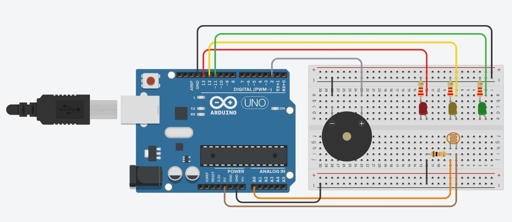

# Check-Point Edge Vinharia

Este projeto consiste na criação de um sistema de monitoramento de luminosidade para o ambiente de armazenamento de vinhos da Vinheria Agnello. O sistema utilizando Arduino que capture informações de luminosidade do ambiente, empregando o uso de um LDR (Light Dependent Resistor).

Com os dados de luminosidade coletados, será implementado um sistema de alarme utilizando LEDs para sinalizar as condições do ambiente. Serão utilizados três LEDs com as seguintes indicações:

LED verde: indica que o ambiente está dentro dos limites estipulados.

LED amarelo: indica que o ambiente está em níveis de alerta.

LED vermelho: indica que há algum problema no ambiente.

Além disso, quando a luminosidade estiver em nível de alerta, uma buzina (buzzer) será acionada por 3 segundos. A buzina continuará soando enquanto a luminosidade permanecer em nível de alerta.

Este é o primeiro passo de um projeto mais amplo de monitoramento, que posteriormente pode ser expandido para incluir a captura e análise de dados de temperatura e umidade.
## Dependências - Materiais Necessários

| Quantidade        | Componente                                                       |
| ----------------- | ---------------------------------------------------------------- |
| 1                 | Arduino Uno R3                                                   |
| 1                 | LDR (Fotorresistor)                                              |
| 1                 | Resistor de 10 kOhm                                              |
| 3                 | Resistores de 220 Ohm                                            |
| 1                 | LED Vermelho                                                     |
| 1                 | LED Amarelo                                                      |
| 1                 | LED Verde                                                        |
| 1                 | Buzzer (Buzina)                                                  |
|                   | Fios (Jumpers)                                                   |
| 1                 | Protoboard                                                       |

## Como reproduzir o projeto?

- Após reunir todos os materiais necessários siga o passo a passo abaixo:

**1. Montagem do circuito:**

- Conecte o Arduino Uno à protoboard.
- Conecte os LEDs aos pinos digitais do Arduino (por exemplo, 13, 12 e 11)
- Conecte o LDR a um dos pinos analógicos do Arduino (por exemplo, A0) e o outro terminal conecte ao 5V.
- Conecte o buzzer a um pino digital do Arduino (por exemplo, 8).
- A seguir, uma imagem para auxiliar na montagem:

    

**2. Codificação do Arduino:**

- Abra o Arduino IDE ou utilize a plataforma online Tinkercad para escrever o código.
- Copie o [código fornecido](Codigo.cpp) e cole no editor de código do Arduino.
- Verifique se o código está de acordo com a montagem do seu circuito.

**3. Teste do sistema:**

- Observe o comportamento dos LEDs e do buzzer de acordo com a luminosidade do ambiente.
- Teste diferentes níveis de luminosidade para verificar a resposta do sistema.

**4. Ajustes (se necessário):**

- Se os limiares de luminosidade ou o comportamento dos LEDs/buzzer precisarem ser ajustados, faça as modificações no código conforme necessário.

## Autores

- [@AliAndrea1](https://github.com/AliAndrea1)

- [@brunacostaz](https://github.com/brunacostaz)

- [@Laurasdc](https://github.com/Laurasdc)

- [@querenprates](https://github.com/querenprates)

- [@sofiafernandes857](https://github.com/sofiafernandes857)

